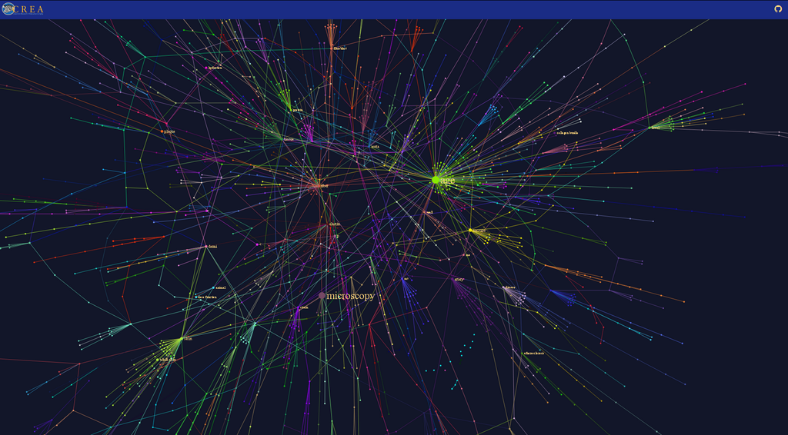

#### Constructing a Knowledge Base on Aging: an Automated Approach
###### Author: Mark Farrell, Undergraduate Student at the University of Waterloo
###### Director: Steven A. Garan, Researcher at Lawrence Berkeley National Laboratory 

#### Abstract

It is the aspiration of the Center for Research and Education On Aging [(CREA)](http://crea.berkeley.edu) to build a knowledge base that can be used by a system to simulate the human aging process at all levels of abstraction. Software was developed to automate the construction of the knowledge base; reading text articles and constructing it solely by hand appears infeasible. The tool can lead to significant process in building the knowledge base on aging, and consequently will provide new insight into the phenomena that drive the aging process.

#### Introduction

 Software was developed to automate the construction of CREA's knowledge base, describing the aging process. Text documents are tokenized into sentences, parsed into constituent trees that detail the phrase-structure of each sentence, and then compiled into a graph. On the graph, each edge and its connect nodes represent a binary predicate that is applied to a subject and object to form a logical proposition; the text is translated into a format that makes structured queries and analyses feasible. New software methods have been developed to find and extract predicates, subjects and objects from English sentences. A software system is being pieced together, to search for keywords related to aging, fetch journal publications that match those keywords, compile the articles into elements of a graph, store all graph elements in one large graph database, and provide a web service that users can visit to browse the knowledge base. 

#### Background Knowledge 

##### Constituents

Constituents are nonterminal nodes of the trees produced by The Berkeley Parser. Each constituent
has a tag, describing the syntactic function of the subtree in relation to the sentence that was
parsed. Constituents are either words, phrases or clauses. See [Penn Treebank II Constituent Tags](http://www.surdeanu.info/mihai/teaching/ista555-fall13/readings/PennTreebankConstituents.html) for details and examples.

##### Phrases

Phrases are constituents that group together several words, but do not form a complete proposition.

##### Clauses

Clauses, in constrast to phrases, are groups of several constituents that form a complete proposition; they can be simple, made up of phrases, or compounded with other clauses. A sentence contains at least one clause. 

#### Instructions

##### Build

To build the current software, install SBT 0.13.0+ and then run <code>sbt stage</code>.

##### Usage

Compile the contents of a textbook into a [GEXF 1.2](http://gexf.net/format/index.html) file, a graph file format.

    ./text-network-compiler -f an_output_file.gexf < an_input_file.txt

##### Contribute

 If you're interested in contributing to the project, feel free to post your questions and
 discuss your plans on both the IRC channel and mailing list.

 * IRC channel: <code>#crea</code> on <code>irc.freenode.net</code>.
 * Mailing list: <code>crea-berkeley@googlegroups.com</code>.

#### Results 

 

#### Resources

 *  [The Open Biological and Biomedical Ontologies](http://www.obofoundry.org/)
 *  [Semantic Parsing using Distributional Semantics and Probabilistic Logic](http://sp14.ws/pub/bem-sp14-2014.pdf)
 *  [Chinese whispers: an efficient graph clustering algorithm and its application to natural language processing problems](http://dl.acm.org/citation.cfm?id=1654774)

